# Korean → English Translation Transformer Experiments

한국어 → 영어 번역 트랜스포머를 직접 구현하고, 데이터 규모·토크나이저·학습 전략 등을 바꾸어가며 성능을 비교한 실험 결과를 정리한 저장소

모델 구현은 Harvard NLP의 Annotated Transformer 코드를 기반으로 하며, 실험 과정을 간단하게 여기에 정리함

> #### 모델 코드 기반  
> - Annotated Transformer: https://nlp.seas.harvard.edu/annotated-transformer/
> #### 사용 데이터셋
> - AIHUB 한국어-영어 번역(병렬) 말뭉치: https://aihub.or.kr/aihubdata/data/view.do?currMenu=115&topMenu=100&aihubDataSe=data&dataSetSn=126
> - nayohan/aihub-en-ko-translation-12m: https://huggingface.co/datasets/nayohan/aihub-en-ko-translation-12m

---

## 1. 데이터셋 및 전처리

### 1-1. 1M 데이터셋 전처리

1M 규모 데이터셋(AIHUB 한국어-영어 번역(병렬) 말뭉치)은 **분류별로 나뉜 여러 xlsx 파일을 하나의 csv로 합친 후, `kor`, `en`, `cat` 세 열만 남기는 방식**으로 전처리

- 여러 개의 xlsx 파일을 로드 후 세로 방향으로 concat
- 불필요한 메타데이터 열 제거
- `kor` (한국어 문장), `en` (영어 번역 문장), `cat` (문장 분류) 열만 남김
- NaN, 비정상 문자열 필터링


| column   |   num_examples |   avg_len |   min_len |   max_len |   p50_len |   p90_len |   p95_len |   p99_len |
|:---------|---------------:|----------:|----------:|----------:|----------:|----------:|----------:|----------:|
| kor      |        1602418 |   57.5784 |         4 |       359 |        59 |        95 |       105 |       123 |
| en       |        1602418 |  141.7    |        10 |       999 |       137 |       251 |       285 |       358 |

| 분류 | 개수 |
|:------------:|:--------:|
| 문어쳬_뉴스 | 801387 |
| 구어체 | 400000 |
| 문어체_한국문화 | 100646 |
| 문어체_조례 | 100298 |
| 문어체_지자체웹사이트 | 100087 |
| 대화체 | 100000 |

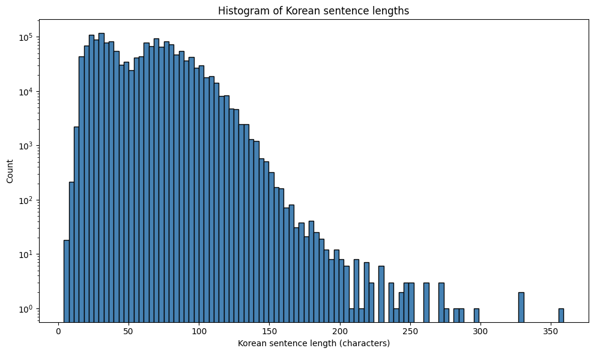
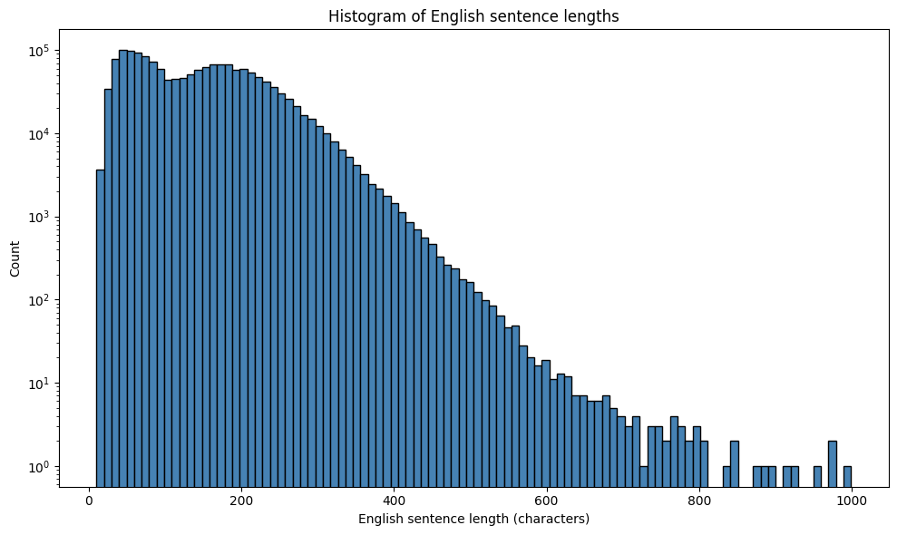


### 1-2. 10M 데이터셋 전처리 (12M → 10M 축소)

[ayohan/aihub-en-ko-translation-12m 데이터셋](https://huggingface.co/datasets/nayohan/aihub-en-ko-translation-12m)을 전처리를 통해 10M 규모로 정제

10M 데이터셋 데이터 개수 **10335375**

| column   |   num_examples |   avg_len |   min_len |   max_len |   p50_len |   p90_len |   p95_len |   p99_len |
|:---------|---------------:|----------:|----------:|----------:|----------:|----------:|----------:|----------:|
| kor      |       10335375 |   53.5398 |         1 |       359 |        50 |        92 |       103 |       123 |
| en       |       10335375 |  125.348  |         2 |       999 |       115 |       224 |       257 |       321 |

| 분류 | 문장 수 |
|:-----------------:|:--------------------:|
| 과학/기술/학술자료 | 3,551,239 |
| 일상/대화 | 2,913,812 |
| 문화/예술/역사 | 1,260,037 |
| 뉴스/시사 | 1,179,584 |
| 의학/보건 | 653,538 |
| 법률/행정 | 621,781 |
| 금융/경제 | 155,384 |

| style | 문장 수 |
|:-----------------:|:--------------------:|
| 문어체 | 6,533,927 |
| 구어체 | 2,913,812 |
| 문어체/구어체 혼재 | 887,636 |

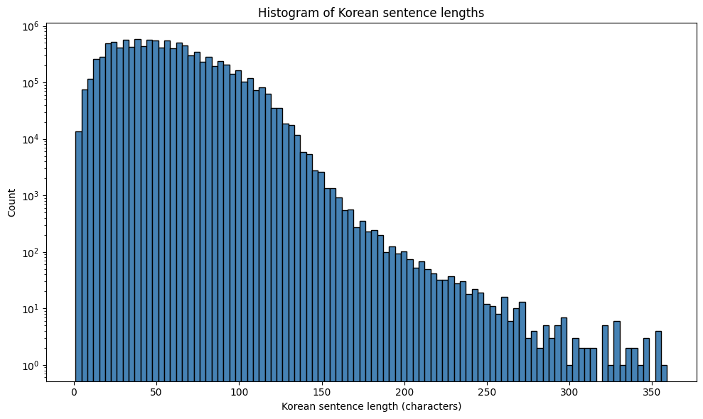


<details>
<summary> <h4> <code> 10M 데이터셋 전처리 과정 </code> </h4> </summary>
<div markdown="1">

#### 1-2-1. 세부 분류 통합 (수백 종 → 8개 대분류)

12M 데이터셋은 여러 데이터셋이 합쳐지면서 **문장 분류(category)가 수백 종(domain 664개, subdomain 657개)**로 나누어져 있어 정리가 필요함

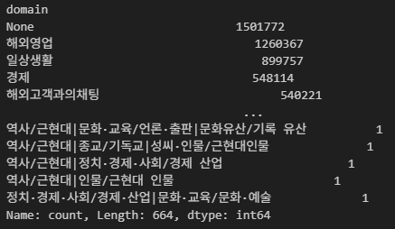
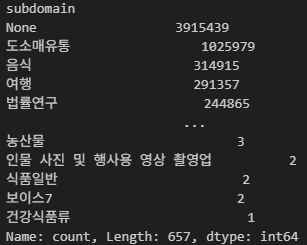


예시:
- "문화", "문화·예술", "문화·교육", "문화재", "민속", "생활·민속", "문화유산", "역사", "역사/근현대", "역사/전통 시대" 등 위와 같은 라벨들을 **단일 대분류 `"문화/예술/역사"`**로 통합

예시와 같이 유사한 문장 분류들을 8개 대분류로 통합
- 유사/중복 라벨들을 규칙 기반 매핑 테이블로 통합
- 최종적으로 약 8개 수준의 상위 카테고리로 정리

> domain, subdomain 값이 None이라서 8개 분류로 정리되지 않고 기타로 분류된 1501722개의 데이터를 확인해보니 1M 데이터셋의 데이터와 완전 동일 ==> 12M 데이터셋에 1M 데이터셋이 포함되어 있었음 
>> 1M 데이터셋의 1602418개의 데이터중 100646개인 문어체_한국문화를 제외한 1501722개가 domain, subdomain None으로 12M 데이터셋에 포함되어있음  
>> --> 1M 데이터셋 분류가 구어체, 대화체인 데이터는 일상/대화로 분류하고 문어체_뉴스, 문어체_지자체웹사이트는 뉴스/시사, 문어체_조례는 법률/행정로 재분류  
>>  문어체_한국문화 100646개는 domain, subdomain이 100158개는 문화/예술/역사 계열, 477개는 뉴스/시사 계열, 11개는 법률/행정 계열로 포함되어 있어 그대로 둠

| 분류 | 문장 수 |
|:-----------------:|:--------------------:|
| 과학/기술/학술자료 | 3,639,412 |
| 일상/대화 | 3,005,075 |
| 뉴스/시사 | 1,457,321 |
| 문화/예술/역사 | 1,279,499 |
| 법률/행정 | 673,907 |
| 의학/보건 | 664,931 |
| 특허 | 359,960 |
| 금융/경제 | 156,204 |


#### 1-2-2. 중복 및 상충 번역 제거

여러 데이터셋을 합치면서 한국어–영어 문장 쌍이 동일하거나 한국어는 같고 영어 번역이 다른 데이터들이 있어 제거

- (kor, en) 쌍 기준 완전 중복 제거
  - 11,236,309 --> 10,983,656
- 동일 kor에 대해 서로 다른 en 후보가 존재하는 경우도 한영 번역 학습에 악영향이므로 제거
  - 10,983,656 --> 10,740,854

중복 처리 후 데이터 수는 **10,740,854**

#### 1-2-3. NaN 및 이상값 처리

##### 1-2-3-1. 문장 앞 기호 제거

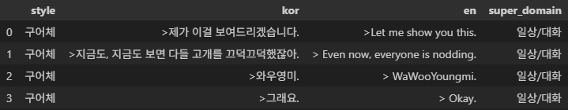
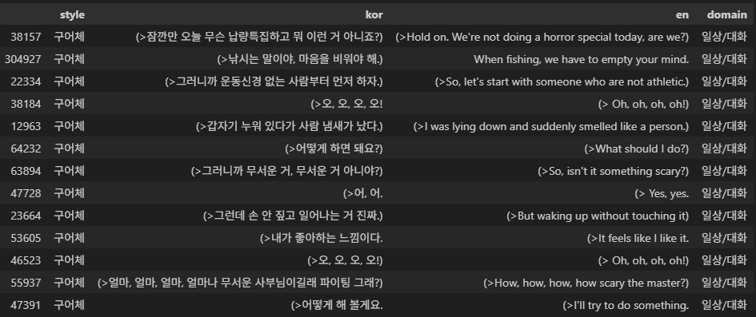

문장 앞에 \>나 \(\>로 시작하는 데이터는 \>와 \(\>를 앞에서 제거하고 데이터셋에 그대로 유지

##### 1-2-3-2. 문어체/구어체 분류(style) None 값 처리

분류 이름에 문어체, 구어체 표시가 되어 있는 1M 데이터셋과 다르게 별도의 style 열에 문어체, 구어체 여부를 저장하고 있어 추후 활용을 위해 남겨두기로 결정

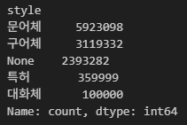

- 하지만 상당수의 데이터는 None으로 표시되어 있어 결측치를 적절한 값으로 채워줄 필요가 발생

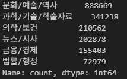

- None style인 데이터가 위에서 통합한 8개 분류 중 문화/예술/역사인 경우 문어체로 된 역사, 정치등의 자료도 있지만,  
방송콘텐츠, 전통문화, 민속, 구비 전승 등 구어체를 포함하는 자료도 있으므로 style 값을 문어체/구어체 혼재로 설정

- 일상/대화는 구어체, 특허는 특허로 두고 나머지 분류들은 전부 문어체로 설정


| style | 문장 수 |
|:-----------------:|:--------------------:|
| 문어체 | 6,555,552 |
| 구어체 | 2,938,318 |
| 문어체/구어체 혼재 | 888,669 |
| 특허 | 358,307 |


##### 1-2-3-3. 문장 NaN 값 처리
`kor`, `en` 중 하나라도 NaN이면 해당 행 제거

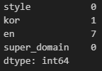

- 처리 후 데이터 수는 **10,740,846**


#### 1-2-4. 문장 필터링

| column   |   num_examples |   avg_len |   min_len |   max_len |   p50_len |   p90_len |   p95_len |   p99_len |
|:---------|---------------:|----------:|----------:|----------:|----------:|----------:|----------:|----------:|
| kor      |       10740846 |   74.6659 |         1 |     10044 |        52 |        98 |       117 |       768 |
| en       |       10740846 |  172.323  |         1 |     10676 |       118 |       242 |       300 |      1756 |


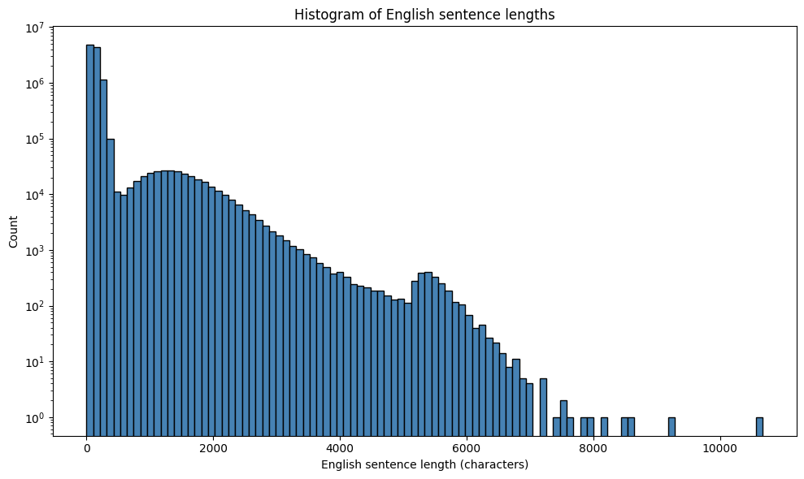

##### 1-2-4-1. 길이가 1~2인 문장 확인

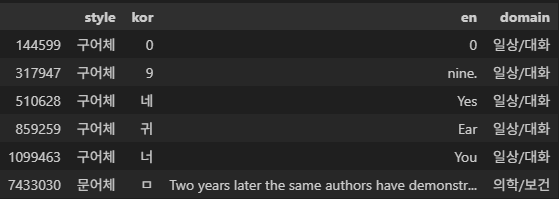
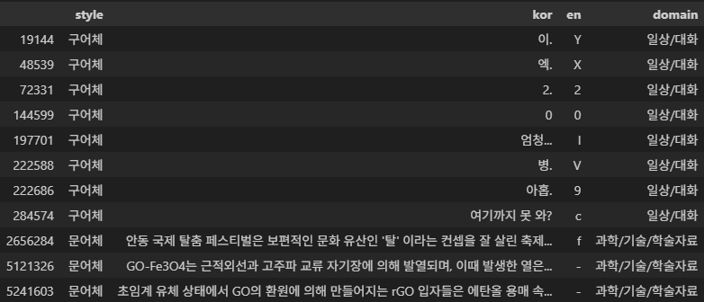
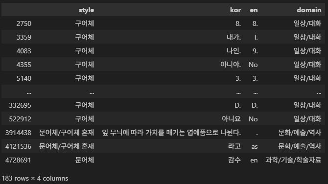

한국어, 영어 문장 쌍 중 한 쪽의 문장이 누락되거나, (이. , Y), (엑. , X), (병. , V)와 같이 한글자 한국어 문장의 앞 자음 발음만 번역한 경우 등을 확인
- 정상 번역 문장도 있고 총 개수가 적으므로 전체 확인 후 이상 문장만 직접 제거

##### 1-2-4-2. 규칙 기반 필터링

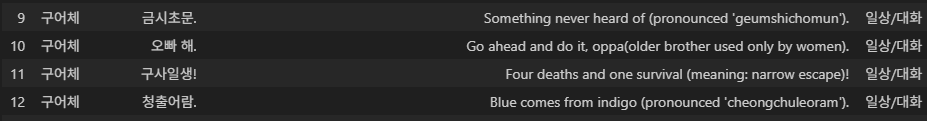
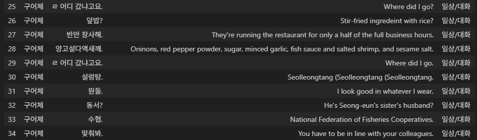
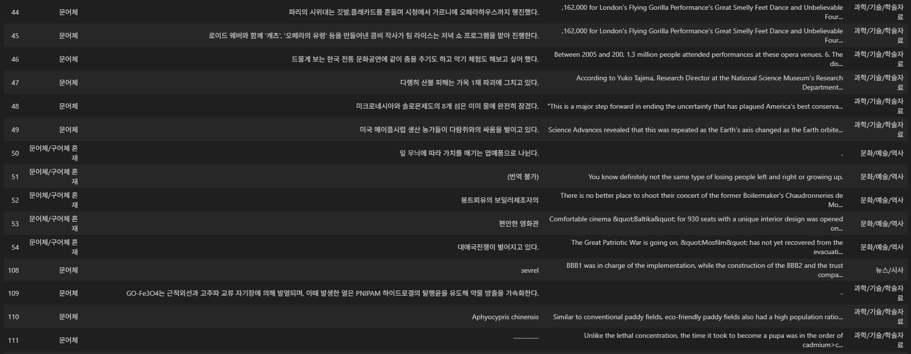
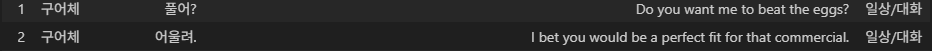

한쪽 언어 문장의 길이가 다른쪽 언어 문장의 길이보다 비정상적으로 긴 경우 확인 (5~10배)를 확인  
- 한국어 문장에는 없는 전후 맥락이 영어 문장 번역에 추가되거나 아예 의미가 다르거나 잘못된 문장이 매치되어 학습 과정에 혼란을 주는 데이터를 확인 가능  
- 추가로 고유어, 관용어구 등을 번역할 때 발음만 번역한 후에 뜻을 추가로 ()안에 넣거나, 반대로 뜻을 직역한 후 ()안에 발음을 추가하거나 하는 과도한 주석이 추가된 문장도 확인함  

이러한 문장들을 제거하기 위해 규칙 기반 필터링을 수행해 2257개의 문장을 필터링
- 일반적으로 데이터의 한쪽 언어 문장이 다른 언어 문장보다 5배 이상 긴 경우
  - 일상/대화 등의 구어체의 경우 정상 번역이지만 영어 문장이 한국어 문장보다 5배 이상 긴 경우가 확인 가능해서 구어체의 경우에는 10배 이상 긴 경우
  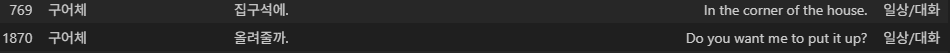
  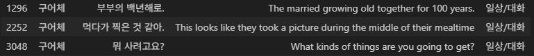
- 한쪽 문장이 누락되거나, ㅁ, ㅣ, c, \`\`\`\`, 등 기호만 남아 있는 경우
- (함께), (All together) 같이 대본, 노래 가사 등의 지시어가 있는 경우

> 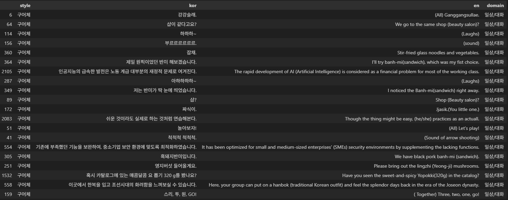
> 필터링 과정에서 정상 문장 데이터도 일부 필터링이 된 것을 확인
>> (혹시 카탈로그에 있는 매콤달콤 요 뽑기 320 g를 봤나요?	, Have you seen the sweet-and-spicy Yopokki(320g) in the catalog?)  
>> (기존에 부족했던 기능을 보완하여, 중소기업 보안 환경에 맞도록 최적화하였습니다., It has been optimized for small and medium-sized enterprises' (SMEs) security environments by supplementing the lacking functions.)

##### 1-2-4-3. 공백 정규화
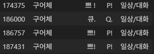  

필터링 확인 과정에서 공백의 종류가 다르거나, 공백이 추가되거나 해서 사실상 같은 문장 쌍이지만 다르게 취급되어 남아 있는 중복들을 발견  
- 모든 공백을 space 1번으로 통일하고 앞뒤 공백을 삭제 후 중복 제거를 한번 더 시행하여 14521개 데이터를 추가 삭제

##### 1-2-4-4. 특허 분류 삭제

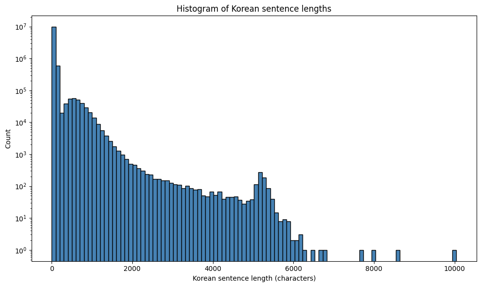


특허 포함 데이터셋 통계

| column   |   num_examples |   avg_len |   min_len |   max_len |   p50_len |   p90_len |   p95_len |   p99_len |
|:---------|---------------:|----------:|----------:|----------:|----------:|----------:|----------:|----------:|
| kor      |       10723850 |   74.7413 |         1 |     10044 |        52 |        98 |       117 |       768 |
| en       |       10723850 |  172.422  |         2 |     10676 |       119 |       242 |       300 |      1755 |

특허 문장 길이

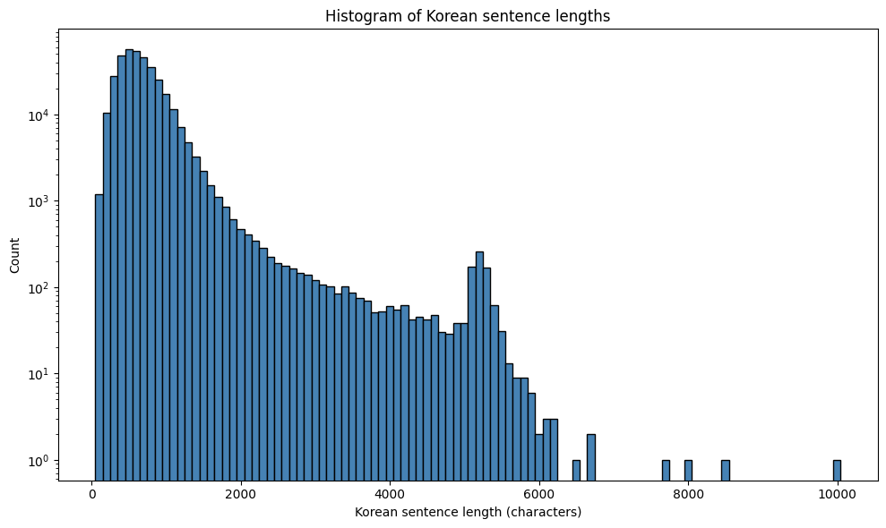
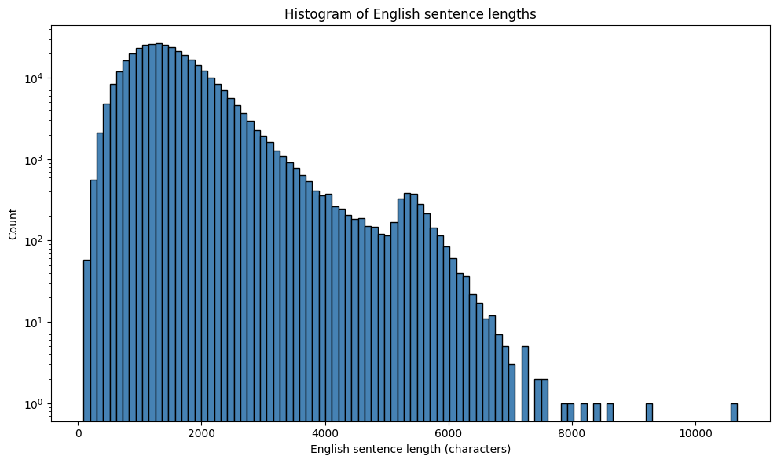

특허 문장 통계

| column   |   num_examples |   avg_len |   min_len |   max_len |   p50_len |   p90_len |   p95_len |   p99_len |
|:---------|---------------:|----------:|----------:|----------:|----------:|----------:|----------:|----------:|
| kor      |         357770 |   688.749 |        49 |     10044 |       613 |      1061 |      1266 |      2193 |
| en       |         357770 |  1535.2   |        90 |     10676 |      1414 |      2372 |      2777 |      4265 |


특허 분류 문장들을 데이터셋에서 제외하기로 결정
- 문장 평균 길이가 매우 커서 메모리 사용량을 크게 늘림 --> 1M 실험과 동일한 배치 크기를 유지 시 GPU 메모리 부족으로 학습이 매우 느려지거나 OOM 에러 발생
- 특허 분류 문장들은 극단적으로 길고 고도로 전문적인 문어체로 이루어져 구어체 성능 개선에 도움이 되지 않음
  - 10M 데이터셋을 추가로 학습하기로 결정한 이유는 후술할 1M 실험 결과  
  문어체, 특히 조례 법령 번역 성능(bleu >~ 55, meteor >~ 0.77, chrf >~ 75)에 비해  
  구어체 성능(bleu <~ 28, meteor <~ 0.60, chrf <~ 52)이 떨어지는 것을 개선하기 위함

##### 1-2-4-5. 길이가 매우 긴 문장 삭제

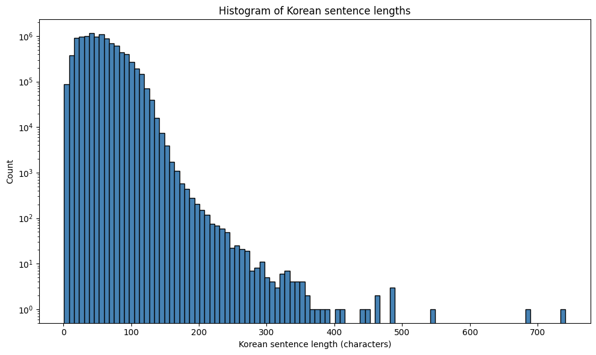
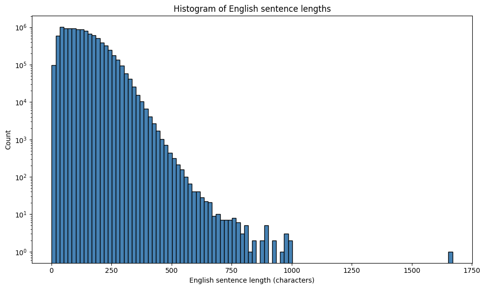

특허 제외 데이터셋 통계

| column   |   num_examples |   avg_len |   min_len |   max_len |   p50_len |   p90_len |   p95_len |   p99_len |
|:---------|---------------:|----------:|----------:|----------:|----------:|----------:|----------:|----------:|
| kor      |       10366080 |   53.5497 |         1 |       741 |        50 |        92 |       103 |       123 |
| en       |       10366080 |  125.388  |         2 |      1669 |       115 |       224 |       257 |       321 |

토크나이저가 문장들을 토큰화할 때, 토큰 개수 최대값은 512로 일정 이상 긴 문장들은 전체 문장이 토큰화되지 않고 뒷부분이 생략되는 상황  
- 한국어 문장에서 생략되는 부분과 영어 번역문에서 생략되는 부분이 언어 차이에 의해 다를 가능성이 높아 학습에 악영향 
  - ==> 한국어 문장 길이가 360 이상인 문장 17개를 데이터셋에서 제외

제외 후 데이터셋 통계

| column   |   num_examples |   avg_len |   min_len |   max_len |   p50_len |   p90_len |   p95_len |   p99_len |
|:---------|---------------:|----------:|----------:|----------:|----------:|----------:|----------:|----------:|
| kor      |       10366063 |    53.549 |         1 |       359 |        50 |        92 |       103 |       123 |
| en       |       10366063 |   125.387 |         2 |       999 |       115 |       224 |       257 |       321 |

#### 1-2-5. 1M 테스트셋 제거

실험 결과 비교를 위해 **1M, 10M 모두 동일한 test set을 사용**

- 1M 데이터셋 실험(시드 고정)에서 test split으로 사용된 `(kor, en)` 쌍에 대해  
10M 데이터셋에서 동일한 `(kor, en)`이 등장하는 행을 전부 제거

10M 데이터셋 데이터 최종 개수 **10335375**


</div>
</details>

### 1-3. 9M 데이터셋

10m 데이터셋 from scratch로 학습하지 않고 1m으로 학습 후 fine tuning 시에 사용할 데이터셋  
- ==> 10m에서 1m과 겹치는 부분 제거


| column   |   num_examples |   avg_len |   min_len |   max_len |   p50_len |   p90_len |   p95_len |   p99_len |
|:---------|---------------:|----------:|----------:|----------:|----------:|----------:|----------:|----------:|
| kor      |        8831242 |   52.9998 |         1 |       359 |        50 |        91 |       103 |       123 |
| en       |        8831242 |  122.98   |         2 |       963 |       114 |       219 |       252 |       314 |

| 분류 | 문장 수 |
|:-----------------:|:--------------------:|
| 과학/기술/학술자료 | 3,551,238 |
| 일상/대화 | 2,431,931 |
| 문화/예술/역사 | 1,166,765 |
| 의학/보건 | 653,538 |
| 법률/행정 | 534,945 |
| 뉴스/시사 | 337,441 |
| 금융/경제 | 155,384 |

| style | 문장 수 |
|:-----------------:|:--------------------:|
| 문어체 | 5,511,679 |
| 구어체 | 2,431,931 |
| 문어체/구어체 혼재 | 887,632 |

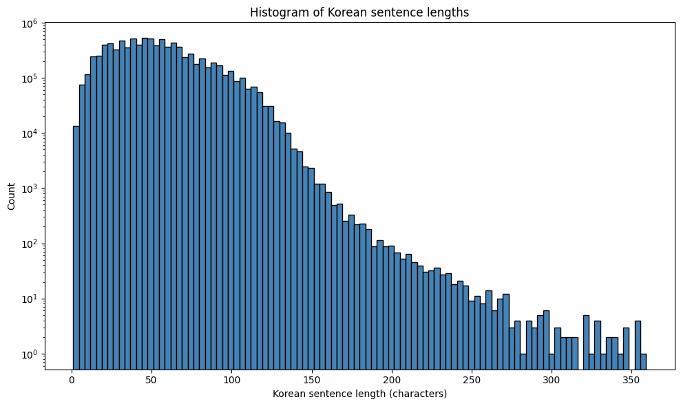
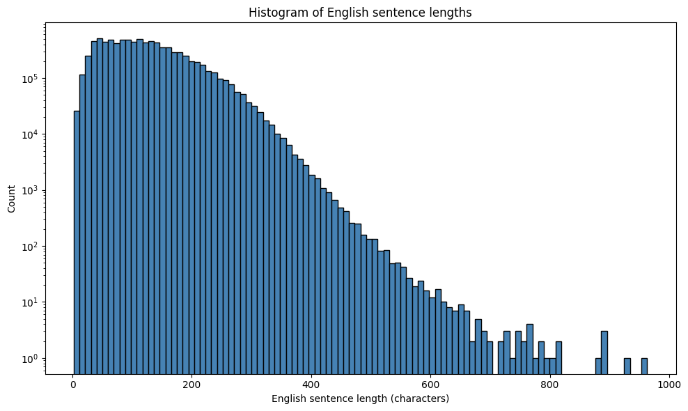


---

## 2. 평가 메트릭

번역 성능 평가는 다음 세 가지 메트릭으로 수행함

- **BLEU**  
  - 전통적인 n-gram 기반 번역 평가 지표
  - 직관적인 비교에 유용하지만, 의미적 동등성을 완벽히 반영하지는 못함
- **METEOR**  
  - 스템·동의어 등을 고려하여 BLEU보다 의미적 유사성을 더 잘 반영
- **ChrF**  
  - 문자 단위 F-score 기반 지표로, 특히 한국어/영어 같은 형태소 구조가 다른 언어 쌍에서 유용

> TODO: metric 선택 이유

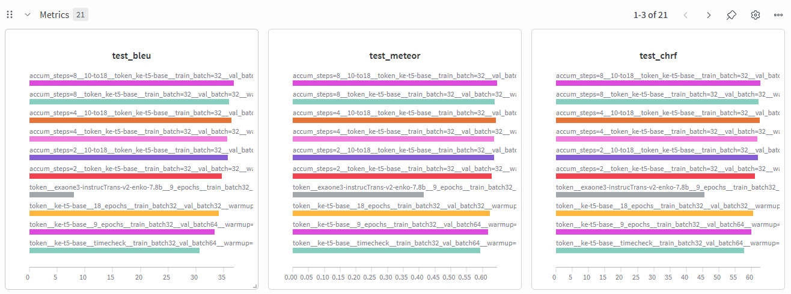

---

## 3. 토크나이저 비교 및 최종 선정

두 종류의 한국어–영어 대응 토크나이저를 비교하여 최종 토크나이저를 선정

### 후보 토크나이저

- `KETI-AIR/ke-t5-base`
- `Translation-EnKo/exaone3-instrucTrans-v2-enko-7.8b`

### 커버리지와 학습 안정성

- `KETI-AIR/ke-t5-base`  
  - vocab size: 64,100  
  - 학습이 안정적으로 진행되며, 수렴도 잘 되는 편  
  - 단, 일부 토큰이 `<unk>`으로 처리:
    - 1M train 전체 토큰(29704824) 중 약 0.05%(14653)가 unknown
      - 
      - 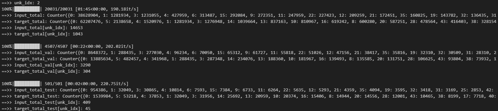
    - 10M train 전체 토큰(TODO:데이터셋 수정 -> 전체토큰수 수정 필요) 중 약 0.08%가 unknown
      - 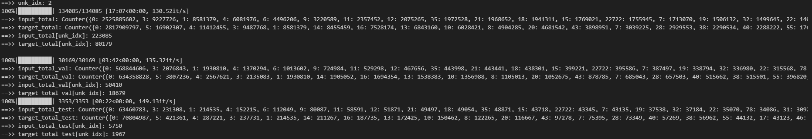
- `Translation-EnKo/exaone3-instrucTrans-v2-enko-7.8b`
  - [nayohan/aihub-en-ko-translation-12m](https://huggingface.co/datasets/nayohan/aihub-en-ko-translation-12m) 데이터셋을 사용해 학습한 모델의 토크나이저
  - 1M, 10M 데이터셋 모두에서 unknown 토큰 없이 전체 문장을 토큰화 가능
    - 
    - 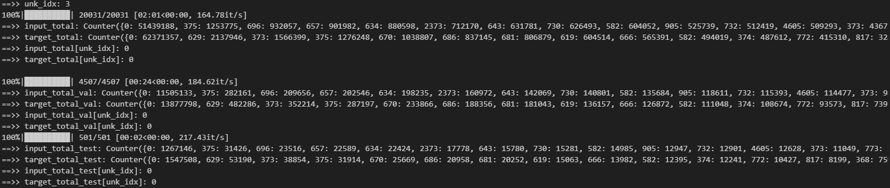
    - 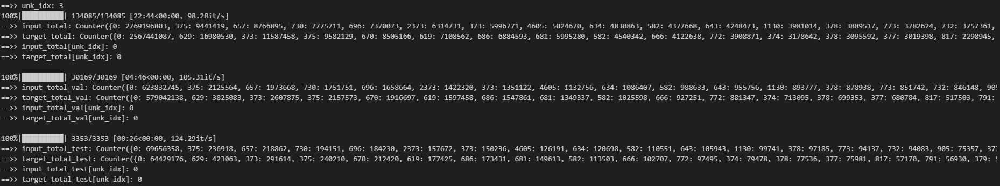
  - 단, vocabulary 크기가 매우 큼 (102,400) → embedding/softmax 차원이 커져 학습이 잘 진행되지 않고, 메모리 사용량도 커짐

### 최종 선택

- **최종 토크나이저: `KETI-AIR/ke-t5-base`**
  - 이유:
    - Vocab 크기가 적당하여 학습이 안정적
    - 소량의 unknown 토큰 비율은 무시 가능한 수준
    - 메모리 사용량과 연산량을 고려할 때 가장 실용적

1M 데이터셋 9 epoch 실험 결과 비교

|             | validatin token loss |    bleu |  meteor |      chrf |
|:------------|---------------------:|--------:|--------:|----------:|
| ke-t5       |              2.66153 | 33.4245 | 0.61783 |  59.88783 |
| exaone-7.8b |              2.83684 | 8.01984 | 0.41363 |  45.54676 |

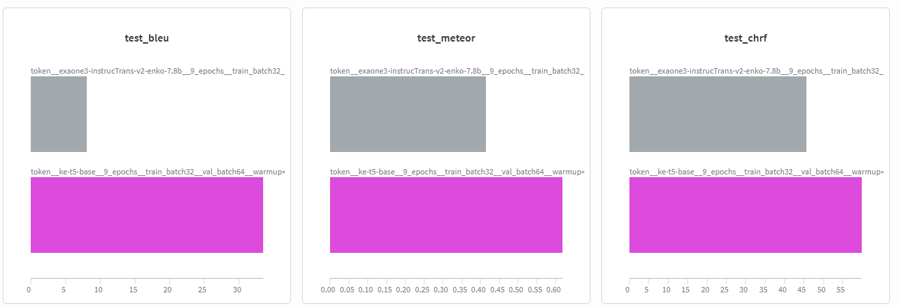
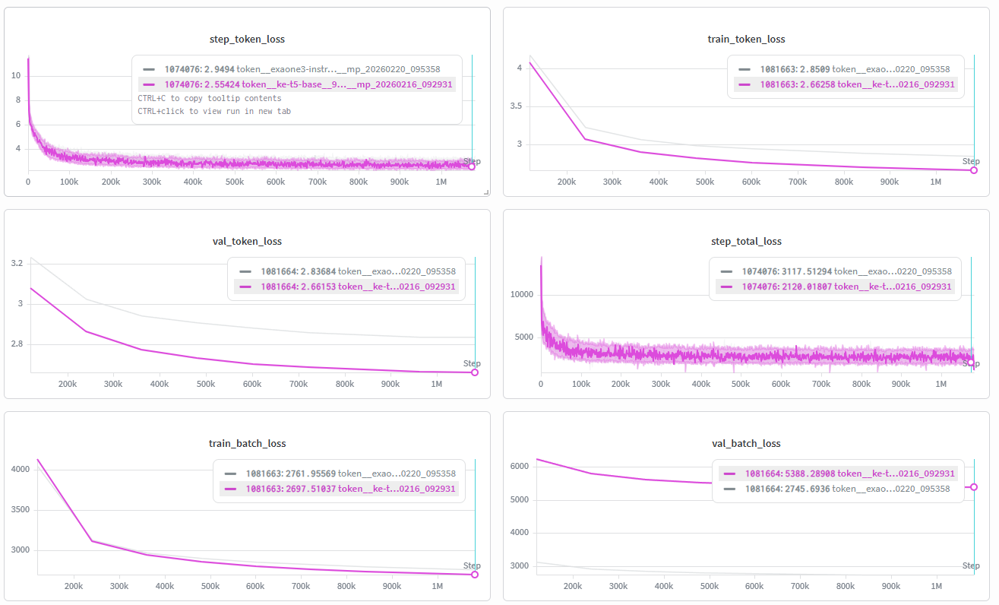

> TODO: 10m 데이터셋에서는 결과가 달라지는지 확인 필요

---

## 4. Learning Rate 스케줄 실험

학습률 스케줄은 **Annotated Transformer 글에서 제안된 함수**를 기본으로 사용하고 관련 변수들을 조정하며 실험

- 형식:  
  $$  
  lr = d_{model}^{-0.5} \cdot \min\left(step^{-0.5}, step \cdot warmup^{-1.5}\right)  
  $$  
- 실험한 변수:
  - warmup step 수 (4,000 / 8,000 / 16,000)
  - step == step/1 vs step_m == step/100
    - 논문은 각 step당 배치 내 source 토큰 2만5천, target 토큰 2만 5천개 정도로 두고 총 100000 step 진행  
    ==> 논문 데이터셋 450만 문장 한 epoch에 180 step ==> 약 556 epoch (100000/180) 진행
    - 내 학습률 실험에서는 배치 당 문장 8개로 두고 실험하여 step/1 그대로 두면 토큰 개수 기준으로는 lr 감쇠가 100배 빠르게 진행됨  
      - 1M 데이터셋 train split 1281934문장의 총 target 토큰 개수 40586486 ==> 문장당 평균 31.66 토큰  
      ==> 배치 8 * 31.66 = 253.28 ==> 25000 / 253.28 ~= 98.705 ==> 대략 100배  
      이 실험 설정에서 100개의 step이 논문의 1 step과 target 토큰 개수가 비슷하므로  
      lr 함수에서 step 대신 step_m == step/100으로 두고 실험해 성능 비교  

> TODO: 단순 감쇠 함수 (예: $a^{-x}$ 꼴의 지수 감쇠)
> TODO: step/epoch 기반 cosine decay 등

### 최종 결과

- **warmup step 수 8000, step/1 조합이 가장 좋은 성능**
  - 예상과는 다르게 step/100보다 step/1가 학습이 안정적이고 성능도 좋은 것을 확인
    - 학습을 진행할 때, step당 전체 loss를 backward 하는 것이 아니라 논문과 동일하게 토큰 1개 당 평균 loss 계산한 후 backward하므로  
    사실상 step 별 weight 갱신 크기가 이미 논문과 비슷함 ==> lr의 step 항을 추가 조정할 필요가 없음

warmup - 1M 데이터셋 3 epoch 실험 결과 비교

|               | validatin token loss |     bleu |  meteor |      chrf |
|:--------------|---------------------:|---------:|--------:|----------:|
| warmup 16,000 |              3.21403 | 26.08797 | 0.54899 |  53.61686 |
| warmup 8,000  |              3.16969 | 26.69073 | 0.55397 |  54.04070 |
| warmup 4,000  |              3.19621 | 26.28067 | 0.55122 |  53.83636 |

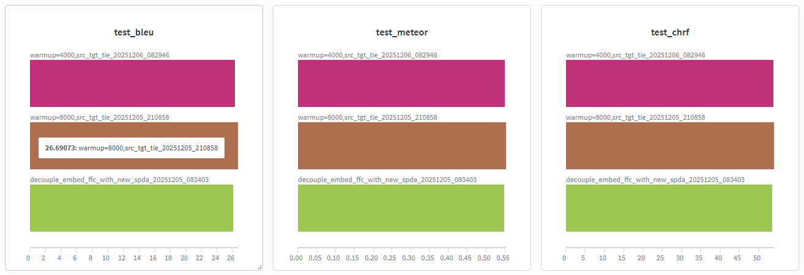
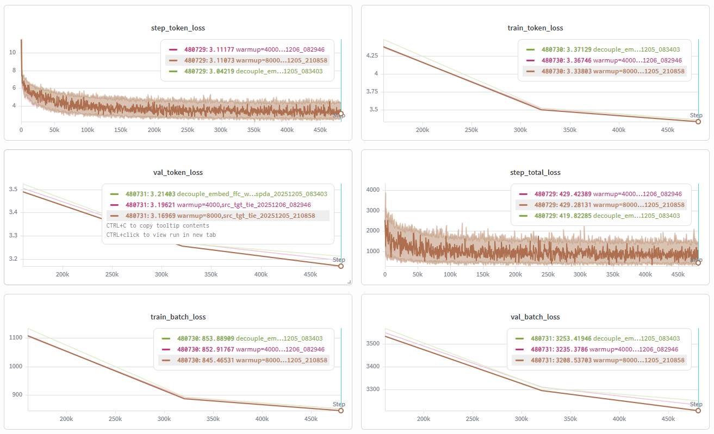

step vs step/100 - 1M 데이터셋 9 epoch 실험 결과 비교
  - step의 경우 3 epoch씩 끊어서 총 9 epoch 학습

|          | validatin token loss |     bleu |  meteor |      chrf |
|:---------|---------------------:|---------:|--------:|----------:|
| step     |              3.11860 | 28.53709 | 0.57593 |  55.77228 |
| step/100 |              3.29259 | 25.32201 | 0.53809 |  52.46701 |

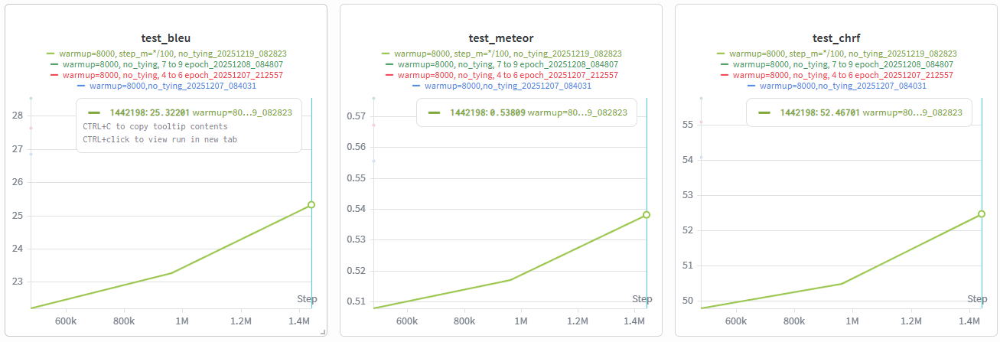
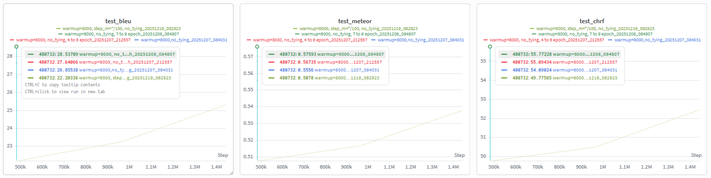
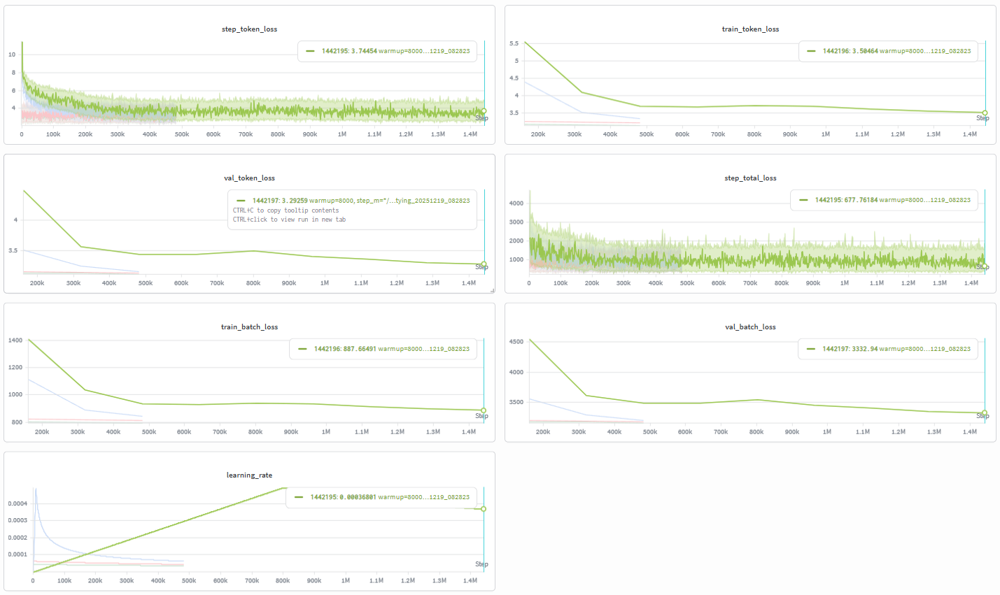
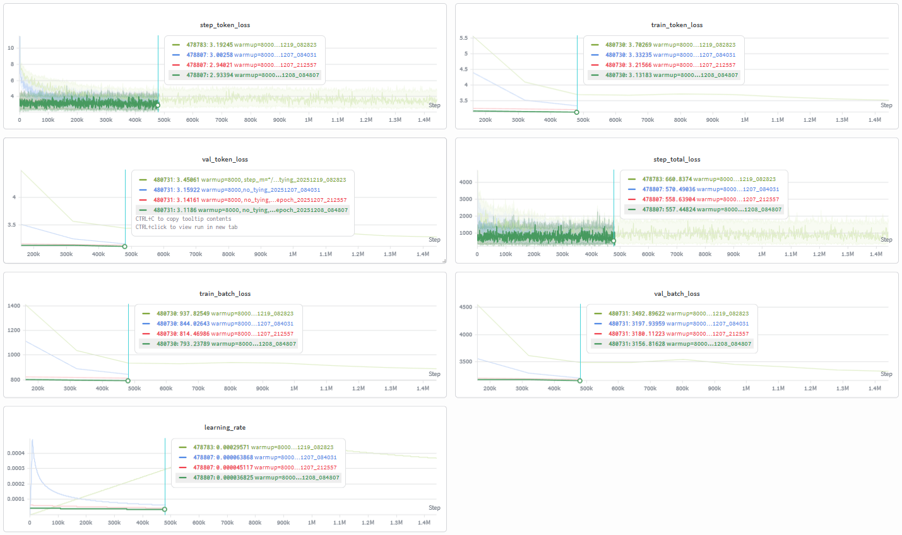

---

## 5. Embedding / Generator Weight Tying 실험

Transformer 구조에서 다음 세 weight 간의 tying 여부에 따른 성능을 비교

- Encoder embedding (입력 임베딩)
- Decoder embedding (출력 임베딩)
- Generator(ffc) weights (decoder output → vocab logits projection)

### 실험 조건

1. **완전 공유 (3-way tying)**  
   - encoder embedding = decoder embedding = generator weights
2. **encoder embedding = decoder embedding (2-way tying)**
3. **encoder embedding = generator weights (2-way tying)**
4. **decoder embedding = generator weights (2-way tying)**
5. **weight tying 미사용 (모두 분리)**

각 설정에 대해 동일한 데이터/하이퍼파라미터로 학습 후 번역 성능을 비교함

### 최종 결과

- **weight tying 미사용 (5번)가 가장 좋은 성능**
  - 한국어를 변환하는 encoder embedding과 모델 결과를 다시 영어로 변환하는 ffc 레이어가 weight를 공유하지만 않으면 성능이 괜찮게 나오는 것을 확인 가능
    - 한국어 -> 한국어 생성이나 영어 -> 영어 생성과는 다르게 구조가 다른 언어간의 번역에는  
    다른 언어를 다루는 레이어간의 weight 공유가 오히려 학습에 악영향을 주는 것으로 추정

1M 데이터셋 3 epoch 실험 결과 비교

|                         | validatin token loss |     bleu |  meteor |      chrf |
|:------------------------|---------------------:|---------:|--------:|----------:|
| 3-way tying             |              3.98467 | 16.41380 | 0.41464 |  41.42203 |
| en_embed == de_embed    |              3.21403 | 26.08797 | 0.54899 |  53.61686 |
| en_embed == ffc_weights |              3.84131 | 15.95757 | 0.41242 |  41.29004 |
| de_embed == ffc_weights |              3.45032 | 25.16554 | 0.53985 |  52.41564 |
| no tying                |              3.21805 | 26.23472 | 0.55195 |  53.72043 |

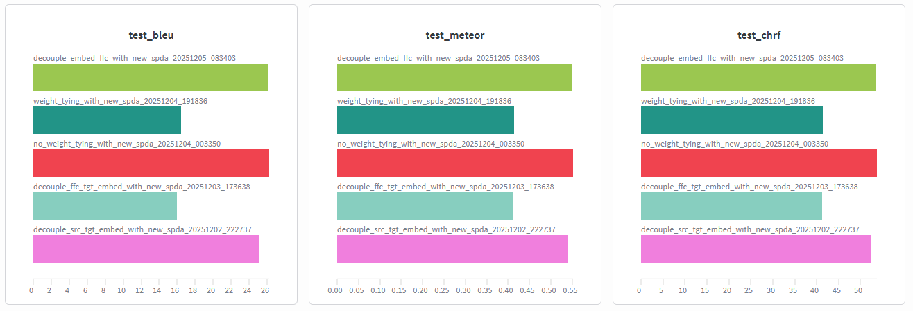
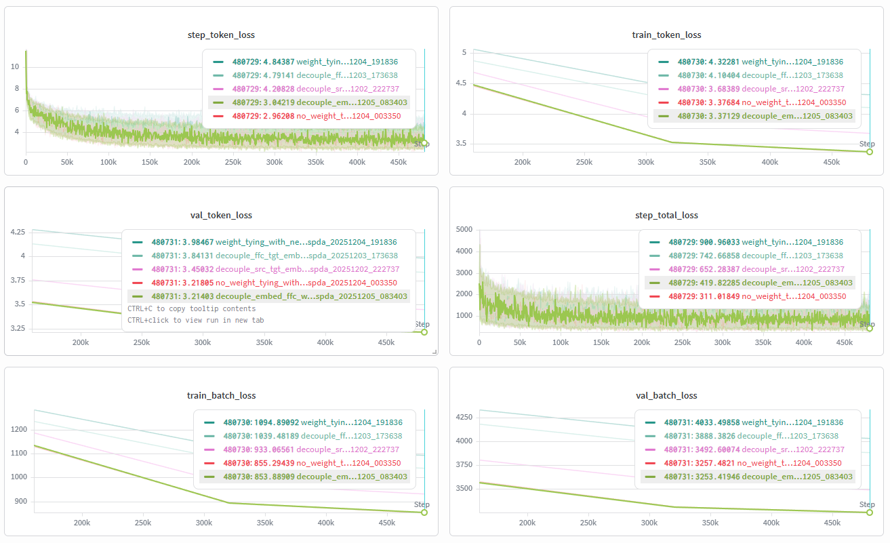

warmup steps 8,000에서 2번, 5번 비교

|                         | validatin token loss |     bleu |  meteor |      chrf |
|:------------------------|---------------------:|---------:|--------:|----------:|
| en_embed == de_embed    |              3.16969 | 26.69073 | 0.55397 |  54.04070 |
| no tying                |              3.15922 | 26.83338 | 0.55560 |  54.09024 |

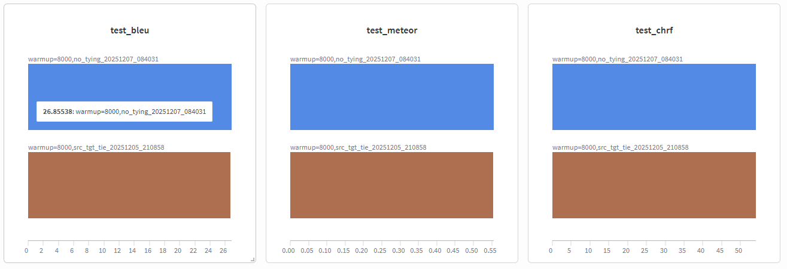
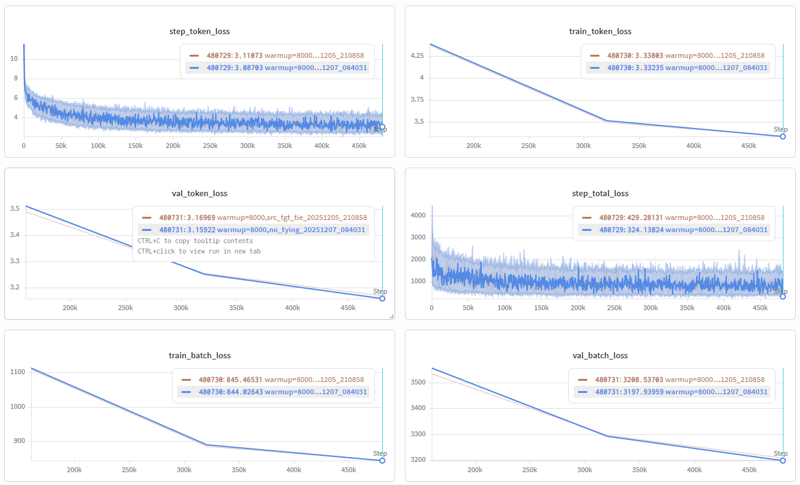

---

## 6. Batch Size 및 Gradient Accumulation 실험

### 6-1. Batch Size와 성능

- 초기 실험: batch size 8 → 16 → 32로 증가  
  - **batch size가 커질수록 성능이 지속적으로 향상**됨을 확인
- GPU 메모리 한계로 인해 batch size를 64 이상으로 직접 올리기 어려워, **gradient accumulation** 도입
  - 예: 실제 batch size 64, 128, 256에 대응하는 effective batch를  
    - base batch 32 + accumulation steps 2, 4, 8 등으로 구성
  - **accumulation step이 늘어날수록 성능이 증가하는 경향** 확인

> TODO: batch size / accumulation step vs BLEU 등의 그래프 (WandB)  
> TODO: 메모리 사용량 vs batch size 비교 표/그래프 자리

---

### 6-2. Batch Size 실험에 따른 메모리 문제 해결 과정

#### 6-2-1. Mixed Precision 도입

- PyTorch AMP (`torch.cuda.amp`)를 사용해 half precision으로 계산  
  - 메모리 사용량 감소  
  - 연산 속도 증가

#### 6-2-2. Sequence 길이 변화에 따른 reserved memory 증가 문제

- 각 batch마다 sequence 길이가 달라질 때, PyTorch가 reserved memory를 계속 늘리는 문제를 관찰
- 해결: **memory pre-allocation** 전략 도입
  - 고정된 최대 토큰 수를 기준으로 메모리를 미리 할당
  - 매 batch에서 이 범위 내에서만 연산하도록 조정

##### 6-2-2-1. Custom Sampler 시도

- 아이디어: batch마다 `token + pad` 개수를 일정하게 유지
  - TODO: 토큰 개수 기준으로 bucket을 만들고, 비슷한 길이 문장끼리 묶어서 배치 구성
- 하지만, 실제 실험에서는 다음 전략이 더 효율적이었음
  - **batch당 문장 개수를 일정하게 유지** 하고 memory pre-allocation 시 `batch_size × (데이터셋 전체에서의 최대 토큰 길이)` 기준으로 할당

##### 6-2-2-2. 메모리 한계 초과 시 동적 처리

batch size가 커지면서,  
`batch_size × max_seq_len` 기준으로 pre-allocation이 불가능한 경우가 발생함

해결 전략:

1. 가능한 범위에서 최대한 크게 memory pre-allocation 수행
2. 해당 범위를 초과하는 규모의 배치가 들어오는 경우:
   - `gc.collect()`, `torch.cuda.empty_cache()`로 메모리 수동 정리
   - 공유 메모리까지 활용하여 해당 배치를 처리
3. 해당 배치가 끝나면:
   - 다시 `gc.collect()`, `torch.cuda.empty_cache()`로 정리
   - 기존 크기로 memory pre-allocation 재수행

> TODO:  
> - pre-allocation 유무에 따른 메모리 사용량/속도 비교 그래프  
> - 길이 분포 / bucket 전략 설명 그림

#### 6-2-3. Gradient Checkpoint 도입

- vocab 크기가 큰 토크나이저(EXAONE 계열)를 사용할 때는  
  각 Transformer encoder, decoder block에 **gradient checkpoint**를 적용하여 메모리 사용량을 추가로 줄임
- 구현:
  - `torch.utils.checkpoint.(m, out, mask, testing, use_reentrant=False)`를 encoder/decoder block에 적용
- 효과:
  - 피크 메모리 사용량 감소
  - 계산량 증가(속도 저하)는 있지만, 더 큰 batch/effective batch로 학습 가능

> TODO:  
> - checkpoint 사용 전/후 메모리 사용량 비교 그래프  
> - checkpoint 사용 전/후 학습 속도 vs 성능 트레이드오프 그래프

---

## 7. WandB 로그 및 결과 정리 (Placeholder)

본 저장소의 실험 결과는 대부분 WandB를 통해 기록함

- 프로젝트 이름: `transformer 한영 번역 실험`

> TODO: 아래 항목에 WandB 링크/이미지 삽입
>
> - [ ] 데이터셋 규모(1M vs 10M)에 따른 성능 비교 그래프  
> - [ ] 토크나이저별 학습 곡선 및 최종 메트릭  
> - [ ] weight tying 설정별 성능 비교  
> - [ ] learning rate 스케줄별 학습/검증 loss 및 BLEU  
> - [ ] batch size / gradient accumulation에 따른 성능 및 메모리 사용량

---

## 8. 재현 방법 (예시)

```bash
# 0. 환경 설치

# 1. 데이터 전처리

# 2. 1M 데이터셋 + 기본 설정 학습

# 3. 10M 데이터셋 + gradient accumulation + best tokenizer 설정

```

---

## 9. 참고 자료
- Annotated Transformer 구현: https://nlp.seas.harvard.edu/annotated-transformer/
- Hugging Face Datasets / Tokenizers 문서: https://huggingface.co/docs/datasets
- PyTorch gradient checkpointing: https://pytorch.org/docs/stable/checkpoint.html